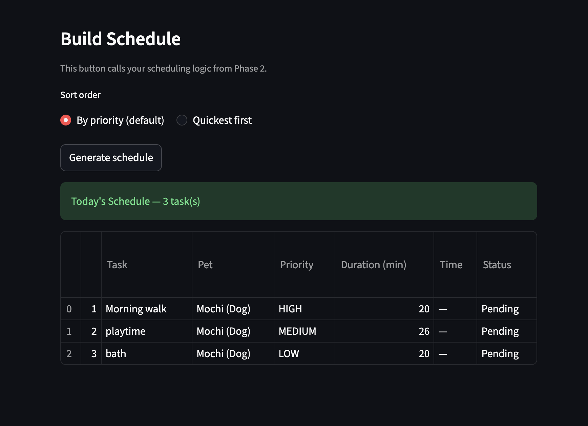

# PawPal+ (Module 2 Project)

You are building **PawPal+**, a Streamlit app that helps a pet owner plan care tasks for their pet.

## Scenario

A busy pet owner needs help staying consistent with pet care. They want an assistant that can:

- Track pet care tasks (walks, feeding, meds, enrichment, grooming, etc.)
- Consider constraints (time available, priority, owner preferences)
- Produce a daily plan and explain why it chose that plan

Your job is to design the system first (UML), then implement the logic in Python, then connect it to the Streamlit UI.

## What you will build

Your final app should:

- Let a user enter basic owner + pet info
- Let a user add/edit tasks (duration + priority at minimum)
- Generate a daily schedule/plan based on constraints and priorities
- Display the plan clearly (and ideally explain the reasoning)
- Include tests for the most important scheduling behaviors

## Features

- **Priority-based scheduling** — `Scheduler.generate_schedule()` filters out completed tasks and sorts the rest by priority (HIGH → MEDIUM → LOW), using duration as a tiebreaker so shorter tasks of equal priority come first.
- **Sort by duration (quickest first)** — `Scheduler.sort_by_time()` re-orders the current schedule by task duration, shortest first. Useful for owners who want to knock out quick tasks before tackling longer ones.
- **Conflict detection** — `Scheduler.detect_conflicts()` checks every pair of timed tasks for overlapping time windows using interval overlap math (`start_a < end_b and start_b < end_a`). Back-to-back tasks are not flagged. Warnings are returned as strings so the app never crashes.
- **Daily and weekly recurrence** — Tasks can be marked `"daily"` or `"weekly"`. When `Scheduler.mark_task_complete()` is called on a recurring task, it automatically creates the next occurrence with an updated due date (`+1 day` or `+7 days`) and appends it to the owner's task list.
- **Filter by pet or completion status** — `Scheduler.filter_tasks()` returns a focused subset of tasks without modifying the schedule. Supports filtering by `completed` (True/False) and/or `pet_name`, and both filters can be combined.
- **Multi-pet support** — Tasks can be assigned to individual pets; owner and scheduler both handle multiple pets simultaneously.

## Smarter Scheduling

The scheduler has been extended with four algorithmic features beyond basic priority sorting:

**Sort by Duration** — `Scheduler.sort_by_time()` re-orders the current schedule by task duration, shortest first. Useful for owners who want to knock out quick tasks before tackling longer ones.

**Filter by Pet or Status** — `Scheduler.filter_tasks()` returns a focused subset of tasks without changing the schedule itself. Filter by completion status (`completed=True/False`), by pet name, or combine both — for example, all of Mochi's incomplete tasks.

**Recurring Tasks** — Tasks can be marked `"daily"` or `"weekly"`. When `Scheduler.mark_task_complete()` is called on a recurring task, it automatically creates the next occurrence with an updated due date (`+1 day` or `+7 days`) and adds it to the owner's task list.

**Conflict Detection** — `Scheduler.detect_conflicts()` checks every pair of timed tasks for overlapping time windows. Any task with a `scheduled_time` set (in `HH:MM` format) is included in the check. Conflicts are returned as human-readable warning strings rather than errors, so the app never crashes — it just informs the owner.

## Getting started

### Setup

```bash
python -m venv .venv
source .venv/bin/activate  # Windows: .venv\Scripts\activate
pip install -r requirements.txt
```

### Suggested workflow

1. Read the scenario carefully and identify requirements and edge cases.
2. Draft a UML diagram (classes, attributes, methods, relationships).
3. Convert UML into Python class stubs (no logic yet).
4. Implement scheduling logic in small increments.
5. Add tests to verify key behaviors.
6. Connect your logic to the Streamlit UI in `app.py`.
7. Refine UML so it matches what you actually built.

### DEMO

<a href="demo.png" target="_blank"></a>.

